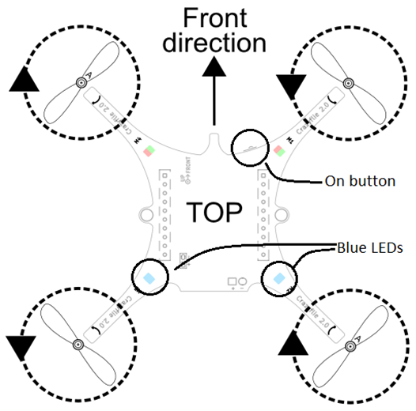

# Resources for Using Bitcraze Crazyflie Drones with Qualisys Systems

[Qualisys motion capture systems](http://www.qualisys.com/) can provide high-speed, reliable, precision position tracking for the closed-loop control of [Bitcraze](https://www.bitcraze.io/) [Crazyflie](https://www.bitcraze.io/crazyflie-2/) quadcopter systems. This repository contains a collection of resources for developing Crazyflie projects and related applications that interact with QTM.

## Setup Instructions

- In QTM, the rigid body that corresponds to the Crazyflie quadcopter should have custom Euler angle definitions:
  - First Rotation Axis: `Z`, Positive Rotation: `Clockwise`, Name: `Yaw`, Angle Range: `-180 to 180 deg.`
  - Second Rotation Axis: `Y`, Positive Rotation: `Counterclockwise`, Name: `Pitch`
  - Third Rotation Axis: `X`, Positive Rotation: `Clockwise`, Name: `Roll`, Angle Range: `-180 to 180 deg.`
- The capture rate should be 100 Hz.
- The Crazyflie USB radio dongle must be set up correctly.
- The Crazyflie drone should be placed on the floor, visible to the cameras, with the front of the Crazyflie pointing in the positive x-direction of the QTM coordinate system. (**Important:** If the front of the drone is not aligned with the x-direction it may **lose control and crash**. The stability of the closed-loop position control algorithm is predicated on correct initial alignment.)

## Python Script Examples

The example Python scripts in this repository are intended to serve as a starting point for implementing custom Crazyflie applications.

All scripts have been tested with Python 3.6.4 running on Windows 10 in a [conda](https://conda.io/) environment.

### Dependencies

- [cflib](https://pypi.python.org/pypi/cflib)
- [qtm](https://pypi.python.org/pypi/qtm/)
- [xmltodict](https://pypi.python.org/pypi/xmltodict)

### Caveats

Albeit small and lightweight, the Crazyflie drone may damage itself, along with objects and people in its vicinity upon contact. Please be mindful of the surroundings and remember that a motion capture / position tracking system does not necessarily provide facilities for collision avoidance.

Additionally, while controlling Crazyflie drones programmatically using a Qualisys motion capture system, please be aware of the following issues:

- Running the control loop that issues `send_setpoint()` commands to the Crazyflie while no position information is relayed (via `send_extpos()`) may cause the drone to **fly uncontrollably and crash**. The control loop that issues commands to the Crazyflie **must be stopped before stopping streaming from QTM**. 
